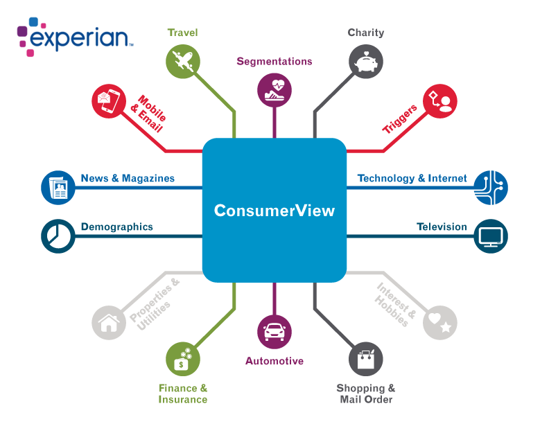

# Customer-Acquisition-Rentention-Using-Experian-Data
### Kane Ren

### Background and the Data

Business can purchase data from Experian to get more insight about their customers.
 
By sending customer information to Experian and pay a fee. It will return back data for the customer in many area.

So my final data contain customers' subscription status and the customer's data from Experian.
 
Subscription Status is base on after a free trial subscription.
 
Active: users continue to subscribe after trial. 
Cancel/Expire: users op out of the subscription after trial.
### Goal
To find out if there is difference between customers that are still subscribing(Active group) vs customers that cancel(Cancel group) base on these data.

E.g.: if the "Active customers" had a significant higher or lower "Play Golf Value" than the "Cancel customers". Then this information can be use to target better customers, result in higher conversion on new customer acquisition or better retention on existing customers.

## Data Preview and Cleaning

- The Data contain 20000 rows.
- For the Categorical Data, from "american express/premium" to "person 1: health being", most of the column has 15745 rows of non-null data.
- For the numerical data, from "act/int wine lovers" and beyond, most has 17052 non-null data.
- a heatmap of missing data is create below to see it in a graphic way.

The heatmap reinforce the difference between missing data for the categorical and numerical data.

When a data is missing in the categorical or numerical, the whole row of data seems to missing as well. I decide to drop all the missing value since it doesn't contribute anything to my analysis.

Since there is a difference between the Categorical and Numerical columns. Before I drop the value,I split the data into two data set. Both will keep the "Sub Type" and "Sub Status Column
  - The result categorical data set will have 15745 row, and the numerical dataset will have 17296 row.

For this project, I will be only working on the numerical columns for now.

### Exploratory Data Analysis(EDA)
Since I want to see the difference between the active group and cancel group, I will be plotting their distribution of both group on the same graph.

By looking at the plot below, we can get a better idea how the distribution of one column of numerical data looks like for each of the user group. Knowing where the mean it is, and get a general idea of the difference.

We can see that for the "wine lovers" column, both user group had a positive skew distribution, with mode around 10, and the mean is 34.5 for the active user group, 39.55 for the cancel group.

Another two example:column "video gamer", and "dog owner" .

From the above images, we can see both user group actually has pretty similar distrubution shape.

However, for "video gamer" column, the mean is far more apart then the "dog owners" column.

### Correlation between numerical variable.
I want to see if there is any correlation between the datas. In the future, if a model is need to be build upon the data, we might able to identify some collinearity relationship here.

To do so, I decide to create a correlation heat map to identify these relationship.

Looking at the correlation heatmap above, we can definitely see some variable with strong correlation.

For example, the "medical policy" and "life insurance policy" has a correlation of 0.91. Creating a scatter plot below.

From the above scatterplot, we can see the strong postive correlation.
 
As one variable increase, the other tend to increase as well.
 
This make sense, since both insurance usually come together.

We can use the same technique to examine other pairs with high correlation as well. By doing so, we might able to eliminate collinearity when building a model in the future.

## Hypothesis Testing

Since the goal is to find out if there is really a difference between the mean score of Active group and Cancel group. A significance test is needed to get the answer. I will perform the test on two column here, but it can apply to all. Since the sample size is really large in this data,8700 for the active group and 8596 for the cancel group. I will just use Z-test since there will be nearly no differnce in the result.

The null and alternative hypothesis is:

$$ H_0: \mu_\text{Active} =  \mu_\text{Cancel} $$
$$ H_A: \mu_\text{Active} \neq  \mu_\text{Cancel} $$

I will also set the alpha for the Z-test to be 0.02.

The two column to perform the test below will be the "wine lover" and "dog owners" columns

For "wine lover" column, we first look at the shape of data. We observe from graph previously, it's highly positive skew, I will perform a square root transformation on the data, the result will display below.

The shape of the data looks symmetric after the transformation, so we can approximate the data with a normal distribution.

Using the Z-Test to see if mean score of wine lover score differ between the Active and Cancel user group yields:

We get a result of Z = -12.196, p-value = 0.000

At $\alpha$=0.02, a p-value of 0.0000 means we reject the null hypothesis test, it's really likely there is a difference between the mean wine lover score between the active group and cancel group.

Apply the same treatment for the dog owner column.
 
Since the distribution of the data is already symmetric, transformation of data is not needed.

For the dog owner column, we get a result of Z = 1.132, p-value = 01288.

At $\alpha$=0.02, a p-value of 0.1288 means we fail to reject the null hypothesis test, we can't say there is a difference between the mean dog owner score between the active and cancel group.

### Confidence interval
In the above significance test, we conclude there is a likely a difference in mean wine lover score between the two group.  

But in order to convince other to take action on it, it is better to provide a confidence interval, the confidence interval provide more context on how much actually the difference is.

Since this is a square root of the data, the range will be from 1 to 10.

Creating a 95% Confidence Interval for the "wine lover" column yields: (-0.5099, -0.3687)

A confidence interval like this mean:
At a scale of 10, we are 95% confidence that the true mean difference between the active group and cancel group is between (-0.5099, -0.3687). In context, the lower the score, the more likely the person is a "Wine Lover", so the active group is more likely to be a wine person.
